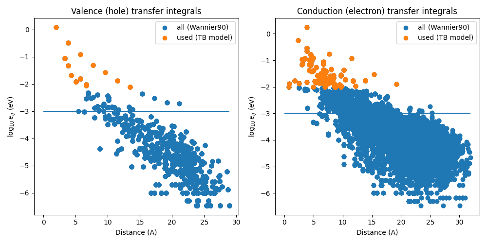
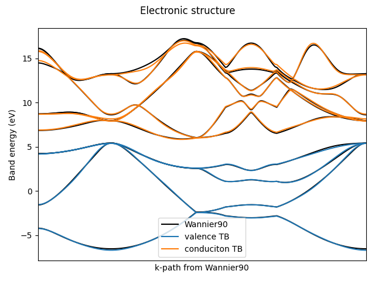
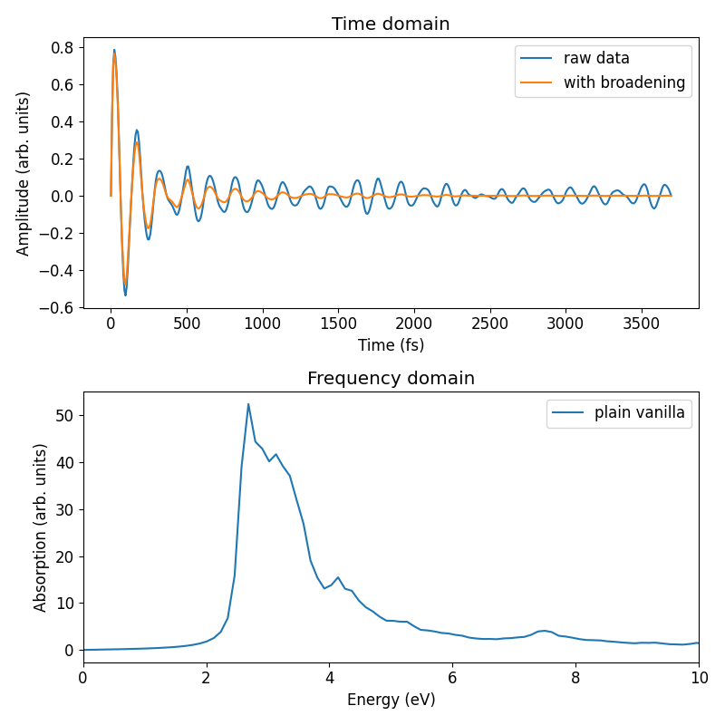
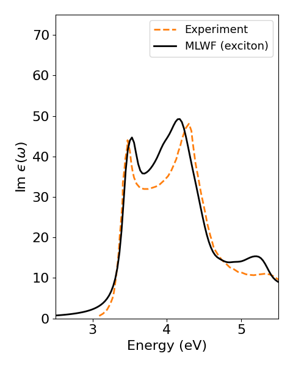

# Tutorial: Silicon

This tutorial shows how to compute the absorption spectrum and exciton density of states for silicon using the linear-scaling Wannier optics approach.

## Requirements
- Compiled executables: `wo-coulomb.x` and `wo-optics.x`
- Python scripts: `python-scripts/wo-absorption.py` and `python-scripts/wo-tight-binding.py` (ensure all required Python packages are installed, e.g. by using the virtual environment)
- Wannier function files (`*.xsf`) for the top valence and bottom conduction bands, generated by `wannier90` (located in `w90_calculations` directory )

## 1. Calculate Electron-Hole Interaction and Optical Transition Dipoles

The interaction between electrons and holes in a material has a direct and strong influence on its optical properties. In the Wannier optics approach, they enter via the Coulomb integrals and local field effects between Wannier functions of the valence and conduction bands. We expect the upper valence bands (holes) and the lower conduction bands (electrons) to be wannierized in two separate calculations, such as those provided in the `w90_calculations` directory.

We first going to use `wo-coulomb.x` to calculate all two-particle parameters which are going to be used to construct the exciton Hamiltonian and initial states. We start by generating template input files:
```bash
wo-coulomb.x -g input.ini
```

You will be ask for the paths to the valence and conduction Wannier functions and their corresponding seednames.

**Expected Output:**
```
...

Generate configuration files for you...
[+] Write configuration file input.ini
[+] Write plan file CUSTOM
Path to valence Wannier functions? w90_calculations/valence_band
wannier90 seedname for valence WF? [default=wannier90] 
[+] Write vmapping.txt
	1 --> w90_calculations/valence_band/wannier90_00001.xsf
	...
Path to conduction Wannier functions? w90_calculations/conduction_band
wannier90 seedname for conduction WF? [default=wannier90] 
[+] Write cmapping.txt
	1 --> w90_calculations/conduction_band/wannier90_00001.xsf
	...
[+] Read mappings from file
Valence Wannier functions:
1 --> w90_calculations/valence_band/wannier90_00001.xsf
...
Conduction Wannier functions:
1 --> w90_calculations/conduction_band/wannier90_00001.xsf
...

[+] Shift conduction Wannier functions to home cell...
	1	: apply shift to home cell (0, 0, 1)
write shifted WF to file: w90_calculations/conduction_band/wannier90_00001_shifted.xsf
	2	: apply shift to home cell (0, 0, 1)
write shifted WF to file: w90_calculations/conduction_band/wannier90_00002_shifted.xsf
	3	: apply shift to home cell (2, 0, 0)
write shifted WF to file: w90_calculations/conduction_band/wannier90_00003_shifted.xsf
	4	: apply shift to home cell (0, 1, 0)
write shifted WF to file: w90_calculations/conduction_band/wannier90_00004_shifted.xsf
	5	: apply shift to home cell (1, 0, 0)
write shifted WF to file: w90_calculations/conduction_band/wannier90_00005_shifted.xsf
	6	: already in home cell
[+] Write cmapping.txt
	1 --> w90_calculations/conduction_band/wannier90_00001_shifted.xsf
	...

(shifted) Wannier centers for valence WF:
	1	: r=(0.678810942806, 2.036239686645, 2.036239688297)
	...
(shifted) Wannier centers for conduction WF:
	1	: r=(1.367889149421, 0.789697745148, 1.367714956532)
	...

[+] Create POSFILE
[+] Done generating POSFILE.

[NOTICE]   If you want to use WannierOptics later, you need to make sure
[NOTICE]   that the generated POSFILE is in agreement with your tight-binding
[NOTICE]   model for valence and conduction band structure!
```

This step creates:
- **`input.ini`**: main control file with parameters and explanations
- **`vmapping.txt`** and **`cmapping.txt`**: mappings from Wannier indices to `.xsf` files
- **`POSFILE`**: contains Wannier centers and unit‑cell information for later use
- **`CUSTOM`**: template for custom Coulomb integrals (only used if `USE_CUSTOM_COULOMB_FILE = 1` in `input.ini`); primarily intended for tests

Furthermore, the program reads each `*.xsf`, computes its Wannier center, and shifts it to the home cell (center of the `wannier90` supercell) if needed to avoid edge artifacts caused by supercell boundaries. Shifted Wannier functions are written in the corresponding directory as `*_shifted.xsf`.


### Modify `input.ini`

Now, we modify the input file that controls the calculation of Coulomb integrals, local field effects and optical transition dipoles. To keep this tutorial fast, we disable three‑ and four‑center integrals, which are the most costly:
```ini
ENABLE_THREE_CENTER_INTEGRALS = 0
ENABLE_FOUR_CENTER_INTEGRALS = 0
```

By disabling these integrals, we focus on the largest two‑center terms and significantly reduce computational time. Of course we would then get a different optical spectrum that the experiment.

Optionally, you can further reduce the computational effort by:
```ini
MONOPOLE_RELATIVE_ERROR_THRESHOLD = 0.08  # more integrals will be approx. using monopole-monopole approx.
ENABLE_LOCAL_FIELD_EFFECTS = 0            # skip local field effects to speed up
```

The default screening parameters are already set for silicon and do not require any changes:
```ini
ENABLE_SCREENING_MODEL = 1
SCREENING_RELATIVE_PERMITTIVITY = 11.68
SCREENING_ALPHA = 1.563
NUM_VALENCE_ELECTRONS = 8
```

### Run the Coulomb Calculation

Execute in parallel (e.g., 10 MPI processes):
```bash
mpirun -np 10 wo-coulomb.x input.ini
```

The program first gives you a short summary of what it will do, reads in all `*.xsf` files and then calculates all necessary two-particle parameters.

This step creates:
- **`COULOMB`**: table of calculated Coulomb integrals
- **`LOCALFILEDEFFECTS`**: table of local field effect integrals
- **`TRANSITIONS`**: table of optical transition dipoles
- **`DATA/`**: intermediate results

We now have calculated all required two-particle parameters. The Coulomb integrals and local field effects will later be used to construct the exciton Hamiltonian. The optical transition dipoles will be used to construct the initial state of the time evolution later.

*Please note that the program might calculate many more Coulomb and local field effect integrals than might be necessary because it is a-prior not known which integrals are relevant and with are zero. Therefore, the scheduler algorithm has to explore the entire space. All integrals are saved in `DATA/` together with intermediate results. The final `COULOMB` and `LOCALFILEDEFFECTS` files only contain a filtered list of integrals (criterions are in `input.ini`) to make sure that the subsequent calculations are independent of the scheduler algorithm and parallelization.*


## 2. Extract Tight‑Binding Models for Valence and Conduction Bands
For the exciton Hamiltonian we also need the single particle electronic structures for electron and holes. In the Wannier basis these are given as two different tight-binding models, which can be imported from the `wannier90` output files.

For this we use the python script `wo-tight-binding.py`, that can be used as a command line tool. To see all options use
```bash
python wo-tight-binding.py -h
```

The script determines the location of the `wannier90` calculations by reading the `vmapping.txt` and `cmapping.txt`. It extracts the tight-binding model from `wannier90_hr.dat`, and `wannier90_wsvec.dat`.
Furthermore, it will determine if some Wannier functions got shifted by comparing `POSFILE` and `wannier90_centres.xyz` and would apply the same shift to the tight binding model such that Coulomb integrals and tight-binding models are consistent.

Within each tight-binding model we only want to keep significant transfer integrals and remove very small ones in order to make the tight-binding model as sparse as possible. For this the python script has two options for pruning:
- manually setting a minimal threshold for all transfer integrals (--min_hopping, default = 1meV)
- using an automatic optimization (--optimize), which finds this minimal hopping

We prune small hoppings automatically to sparsify the model:
```bash
python ./wo-tight-binding.py . --optimize
```

**Expected Output:**
```
Use output directory of Coulomb calculation:  .
[+] Read mapping files.
   - read ./vmapping.txt
   - found w90 calculation for valence states: w90_calculations/valence_band, seedname: wannier90
   - read ./cmapping.txt
   - found w90 calculation for conduction states: w90_calculations/conduction_band, seedname: wannier90
[+] Read Wannier Hamiltonian from w90 calculations.
   ...
[+] Read POSFILE from ./POSFILE
   - check compatibility with w90 calculations
[+] Make tight-binding model compatible with POSFILE (compatible with Coulomb calculations)
	...
[+] Additional pruning of the tight-binding model
	...
[+] Clean up TB-model.
	...
[+] Optimize min_hopping.
	...
[+] Plot results.
	...
[+] Write wannier-optics input files.
write ./TINFILE_v
write ./ONSITE_ENERGY_v
write ./TINFILE_c
write ./ONSITE_ENERGY_c
write ./PARFILE
Finish.
```




This step creates:
- **`ONSITE_ENERGY_c`**, **`ONSITE_ENERGY_v`**: onsite energy for each conduction and valence Wannier function respectively
- **`TINFILE_c`**, **`TINFILE_v`**: transfer integrals for each conduction and valence Wannier function respectively
- **`PARFILE`**: central input file of `wo-optics.x` (can also be created later, see next section)

With this we have calculated / imported all parameters of the exciton Hamiltonian. The single particle parameters stored in `POSFILE`, `TINFILE_*` and `ONSITE_ENERGY_*`. Two-particle parameters are stored in `COULOMB`, `LOCALFIELDEFFECTS` and `TRANSITIONS`.

## 3. Compute Optical Absorption Spectrum and Exciton Density of States

After calculating all parameters the next step is to create and solve the exciton Hamiltonian on a large supercell (equivalent to a fine k‑grid) using `wo-optics.x`.

We first generate template input files for `wo-optics.x`:
```bash
wo-optics.x -g
```

This creates the `PARFILE`, which is the main input file of `wo-optics.x` and controls all numerical parameters for the time evolution and density of states calculations.

To speed up the calculation we can reduce the number of time steps to 500:
```ini
nT = 500
```


### Set Supercell (k‑grid) in `POSFILE`

The first line of `POSFILE` defines the size of the supercell and perdiodic boundary conditions. For a 30×30×30 supercell with periodic boundary conditions use:

```
30 30 30 y y y
model
 2.715000000000 2.715000000000 0.000000000000
 0.000000000000 2.715000000000 2.715000000000
 2.715000000000 0.000000000000 2.715000000000
4
C
 ...  # valence Wannier centers
6
C
 ...  # conduction Wannier centers
```

For silicon this supercell is not large enough to obtain converged results and the obtained spectrum will therefore be different to the experiment. To get convergence you need at least a 50x50x50 or larger supercell, which corresponds 50x50x50 Γ‑centered k‑grid.

*Please note that the required memory highly depends of the size of the supercell. For a 30x30x30 calculation you need arount 12.2GB RAM. If you want to test with less memory you might want to use a 20x20x20 supercell, which gives a slightly different result.*

### Run the Optical Calculation

Execute in parallel (e.g., 10 MPI processes):
```bash
mpirun -np 10 wo-optics.x
```

The program sets up the exciton Hamiltonian, calculates the exciton density of states and performs the time evolution starting from the optical transition dipoles (see paper for more details of the method).

Results will be stored in `output/`:
- **`T000Kdensity.dat`**: exciton density of states
- **`T000KOverlap`**: autocorrelation function of optical dipoles
- **`OUTFILE`**: summary of inputs and internal parameters
- **`T000Kanbn`**, **`T000Kcn`**: internal Lanczos and Chebyshev parameters
- **`T000KNormPsi`**: wave function normalization (for test purposes)

*The code sets up the exciton Hamiltonian as a sparse matrix that could be distributed over multiple compute nodes if you run it on a high performance cluster. In the current implementation it needs to know the number of off-diagonals (`NNEIGH`) in advance. By setting `NNEIGH = -1` in the `PARFILE` we have used a heuristics to determine this number. However, this might not be optimal and could also fail in some situations. Therefore it is sometimes better to set it manually (e.g. by trail and error). E.g. `NNEIGH = 403` gives you optimal performance. This might be improved in the future.*

### Extract the Optical Absorption Spectrum

From the autocorrelation function we can calculate the optical absorption spectrum including some broadening:
```bash
python ./wo-absorption.py output -o spectrum.dat
```

As before you can use `python ./wo-absorption.py -h` to see all options. E.g. you can try different broadenings in units of meV or fs whatever is more natural for you:
```bash
python ./wo-absorption.py output/ --broadening 80  # in meV
# or
python ./wo-absorption.py output/ --tau 822.76     # in fs (alternative)
```

The optical absorption spectrum looks liket this:



Unter `converged_calculation/` you can find the input files for the converged calculation. This calculation uses all kinds of Coulomb integrals and a `50x50x50` supercell. The optical absorption spectrum is then given by

