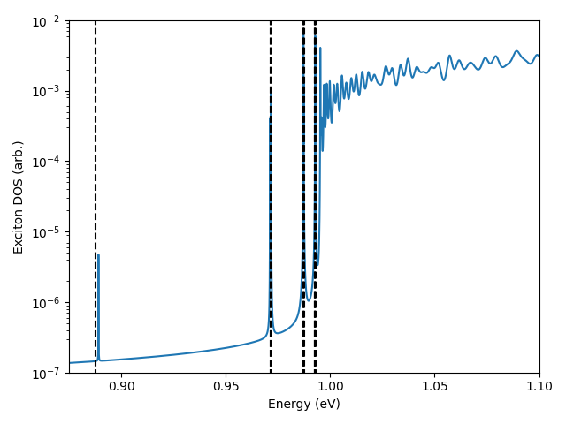

# Tutorial:  Wannier-Mott Exciton Model / H-atom

In this tutorial we want to perform a model calculation of a Wannier exciton without using wannier90. This model can also be used as an implementation test since we can calculate the excitation energies analytically. With this tutorial you learn how the input files of `wo-optics.x` work and how to setup individual models manually.

The following steps are also described in appendix of
Merkel, K. & Ortmann, F. Journal of Physics: Materials 7, 015001 (2024)

*Please note that the name Wannier optics comes from the fact that we are using Wannier functions. It is not at all related to the type of exciton. In fact, using Wannier optics you can calculate all kinds of excitons, e.g. Frenkel excitions.*

## Requirements
- Compiled executable: `wo-optics.x`

## Wannier-Mott Exciton Model

We assume a cubic lattice of length $L$ with one site per unit cell and nearest neighbor hopping for electrons and holes. The electronic structure is given by a tight-binding model,

$$
H_{el} = \sum_{<ij>} -t_\text{el} a_i^\dagger a_j + E_0, 
$$

$$
H_{h} = \sum_{<ij>} t_\text{h} h_i^\dagger h_j.
$$
The resulting band structure can be found as
$$
E_\text{el}(k) = -2t_\text{el} \left( \cos(k_xL) +\cos(k_yL)+\cos(k_zL)\right) + E_0,
$$
$$
E_\text{h}(k) = 2t_\text{h} \left( \cos(k_xL) +\cos(k_yL)+\cos(k_zL)\right).
$$

We construct the exciton Hamiltonian and include the electron-hole interaction. For simplicity we chose a static screening with $\epsilon_{\infty}$ and do not include local field effects. The resulting model is given by

$$
H(k,k') = \left[ E_\text{el}(k) - E_\text{h}(k) \right] \delta_{kk'} - \frac{1}{\epsilon_{\infty}} \tilde{V}(k-k'),
$$

where $\tilde{V}(k-k')$ is the bare Coulomb potential in $k$-space.
To obtain an analytical solution of this model, we perform a Taylor expansion of the band energies around $k=0$

$$
E_\text{el}(k) - E_\text{h}(k) 
\approx E_0 -2(t_\text{el} + t_\text{h}) \left( 3-\frac{1}{2}L^2|k|^2  + \frac{1}{24}L^4 |k|^4 - ...  \right)
$$

By expanding the exciton Hamiltonian up to second order we obtain the **hydrogen-like problem**,

$$
H(k,k') 
= \frac{\hbar^2k^2}{2\mu} \delta_{kk'} - \frac{1}{\epsilon_{\infty}} \tilde{V}(k-k') + E_\text{g},
$$

with an effective mass $\mu = \frac{\hbar^2}{2(t_\text{el} + t_\text{h})L^2}$ and $E_\text{g} = E_0 -6(t_\text{el} + t_\text{h})$ the band gap without electron-hole interaction. The exciton energies follow a **Rydberg series**,

$$
E_{n} = E_\text{g} - \frac{R_\text{ex}}{n^2\epsilon_{\infty}^2}m
$$

where the exciton Rydberg energy $R_\text{ex}$ and exciton Bohr radius $a_\text{B}$ are,

$$
R_\text{ex} = \frac{e^4 \mu}{2(4\pi \epsilon_{0})^2 \hbar^2}
$$

$$
a_\text{B} = \frac{4\pi\epsilon_{0} \epsilon_{\infty} \hbar^2 }{\mu e^2}.
$$

This result can be further improved by calculating the energy shifts due to the $k^4$ term, which would correspond to a relativistic correction of the hydrogen atom (fine structure without spin-orbit coupling). In complete analogy, they can be calculated using perturbation theory,

$$
\Delta E_{nl}
= -\frac{1}{12} \frac{E_n^2}{(t_\text{el} + t_\text{h})}  \left[ \frac{4n}{(l+1/2)} - 3 \right].
$$


## Numerical Implementation using `wo-optics.x`

Now, we want to use `wo-optics.x` to calculate the exciton excitation energies numerically. That means we only want to calculate the **exciton density of states** from which we can obtain the Rydberg series. We don't need to calculate any optical spectra.

The program creates the exciton Hamiltonian according to Eq.(12) in J. Phys. Mater. 7, 015001 (2024). The first step is to tell `wo-optics.x` the tight-binding model and Coulomb interaction. For this we want to use the following model parameters:
$$
t_\text{el} = -1.0 \text{ eV, }~
t_\text{h} = 1.0 \text{ eV, }~
E_0 = 13 \text{ eV, }~
L = 15 \text{ A, }~
\epsilon_\infty = 1
$$

### Tight Binding Model for Electrons and Holes
We start by setting up the tight binding model for electrons and holes.

**POSFILE**

The `POSFILE` contains all information about geometry and positions. It has the following form:
```
 350 350 350 y y y  
model
 15.0	0.0 	0.0
 0.0	15.0	0.0
 0.0	0.0 	15.0
1
C
 0.0	0.0 	0.0
1
C
 0.0	0.0 	0.0
```

- line 1: dimensions of the supercell and periodic boundary conditions for each lattice vector (here: supercell consists of 350x350x350 primitive unit cells with periodic boundary conditions at the edge of the supercell. This corresponds to a $\Gamma$-centered 350x350x350 k-grid)
- line 2: comment, will not be used
- line 3-5: primitive unit cell
- line 6: number of valence Wannier functions
- line 7: determines if the following coordinates are given with respect to Cartesian coordinates (`C`) or in terms of lattice vectors (`D`)
- line 7: centers for each Wannier function (every Wannier function is a new line, here we only have one Wannier function)
- line 8-10: same for conduction Wannier function (number, `C` or `D`, Wannier centers)


**TINFILE_c**

The `TINFILE_*` stores the transfer integrals of the single particle tight-binding model. (`*_c` for conduction Wannier functions and `*_v` for valence Wannier functions)
```
6
l1 	l2 	Dx 	Dy 	Dz 	TI
1	1	1	0	0	-1.0    0.0
1	1	-1	0	0	-1.0    0.0
1	1	0	1	0	-1.0    0.0
1	1	0	-1	0	-1.0    0.0
1	1	0	0	1	-1.0    0.0
1	1	0	0	-1	-1.0    0.0
```

- line 1: total number of transfer integrals (number of rows in the table)
- line 2: comment, will not be used
- line 3-end: each transfer integral, `l1`, `l2` are the indexes of the Wannier functions, `Dx, Dy, Dz` is the shift vector between them (in terms of lattice vectors), last two columns are the real and imaginary part of the value of the transfer integral

*Please note that you have to provide also the hermitian conjugate connection in this file.*

**TINFILE_v**

(Analog to `TINFILE_c` but for the valence Wannier functions)
```
6
l1 	l2 	Dx 	Dy 	Dz 	TI
1	1	1	0	0	1.0    0.0
1	1	0	1	0	1.0    0.0
1	1	0	0	1	1.0    0.0
1	1	-1	0	0	1.0    0.0
1	1	0	-1	0	1.0    0.0
1	1	0	0	-1	1.0    0.0
```


**ONSITE_ENERGY_c**

The `ONSITE_ENERGY_*` files store the onsite energy for each Wannier function. (`*_c` for conduction Wannier functions and `*_v` for valence Wannier functions)
```
1
13.0
```

line 1: Number of Wannier function (length of the list)
line 2-end: onsite energies for each Wannier function

**ONSITE_ENERGY_v**

(Analog to `ONSITE_ENERGY_c` but for the valence Wannier functions)
```
1
0.0
```

At this stage we have set the single particle tight-binding models for electrons and hole. To make them interact with each other we need to include the Coulomb interaction.


### Coulomb Interaction
The interaction between electrons and hole consists of the Coulomb interaction and local field effects. They must be provided as a set of integrals according to Eq.(15) and Eq.(16) in J. Phys. Mater. 7, 015001 (2024). Usually we use the `wo-coulomb.x` program to calculate such lists of integrals. However, in this tutorial we don't need to.

**COULOMB**

The `COULOMB` file stores all screened Coulomb integrals between valence and conduction Wannier functions as a list. Each Coulomb integral is labels by (c1,c2,v1,v2, RD, Rc, Rv), i.e. the indexes of the Wannier functions and 3 shift vectors in units of primitive lattice vectors. (More detail are given in the paper.)

For our case we only have monopole-monopole interaction between electron and hole. (We assume that our Wannier functions are delta distribution without any spread.) We only need to provide a single Coulomb integral for the case $c_1=c2=1$, $v_1=v_2=1$, $R_D=R_c=R_v=0$, i.e. when electron and hole are at the same position. In this case the Coulomb interaction would diverge. To avoid this we can just set it to some finite value (and hope it would not effect the outcome to much).
The `COULOMB` file then looks like this:
```
1 0.0 1.0
# Coulomb Matrix Elements in units of eV
#c1 c2 v1 v2  RD     Rc     Rv     Real(W) Imag(W)
 1  1  1  1   0 0 0  0 0 0  0 0 0  1.0     0.0
```

- line 1: three numbers
	- number of Coulomb integrals in the table (without comments)
	- maximal electron-hole distance: Coulomb integrals with larger electron-hole distance will be set as monopole-monopole interaction (don't need to be set explicitly in the table), whereas Coulomb integrals with smaller electron-hole distance **must** explicitly set in the following table
	- inverse of the static screening parameter $1/\epsilon_\infty$. This a global factor that is multiplied to all Coulomb integrals
- line 2,3: all lines that start with '#' are comments
- line 4-end: list of Coulomb integrals


**LOCALFIELDEFFECTS**

The `LOCALFIELDEFFECTS` file is in the same format as the `COULOMB` file, but since the LFE integrals have fewer parameter we always set $R_D=0$.
```
0 0.0 1.0
# Coulomb Matrix Elements in units of eV
#c1 c2 v1 v2 RD (dummy for LFE)  Rc (S1 for LFE)  Rv (S2 for LFE) Real(W) Imag(W)
```
Local field effects don't have a maximal electron-hole interaction and no screening. That means the 2nd and 3rd value of the first line are always 0.0 and 1.0.

In our case we don't have any local field effects and therefore don't need to give any integrals. However, we need to provide the file (at least the first line of it).

## Other files
**TRANSITION**

This file stores the optical transition dipoles between electron and hole. This is only required if we want to calculate an optical spectrum. Since we are only interested in the density of states we can provide an empty list:
```
0
# Optical Transition Dipoles
#c	v	shift vector		dipole (x,y,z)
```
(First line would be enough.)

At this step we have completely described the exciton Hamiltonian for which we want to calculate the density of states. The last step is to set all numerical parameters for the actual calculation.


### Input Parameters for `wo-optics.x`
Luckily, we don't need to know every parameter. We can simply generate a template input file using
```
wo-optics.x -g
```

This will generate a template `PARFILE` with all parameters, a litte description and their default values. We only need to change the following parameters (leave everything else as default):
```ini
 # ...

 # Number of neighboring connections for every site:
 # values < 0 : use heuristics (might not work or is inefficient)
 NNEIGH       =            6

 # Number of time steps:
 nT           =            0  # we do not want to calculate any spectrum

 # Lorentzian broadening of the peaks (in the DOS)
 EPS          =    1.0E-5

 # Energy steps and boundarys for DOS output file:
 N_ENERGIES   =       320001
 DOSEMIN      =    0.0000000000000000
 DOSEMAX      =    10.000000000000000

 # ...
```

## Computation and Output

Now, everything is ready and we can run the calculation:
```
mpirun -np 8 ./wo-optics.x
```

The exciton density of states stored under `output/T000Kdensity.dat`. To compare the result with the analytical solution you can use the python-script `peak_analyse.py`.

**350x350x350 - supercell**




We can see that the first peak (1s orbital) is slightly displaced. This is because we have set the Coulomb integral for $c_1=c2=1$, $v_1=v_2=1$, $R_D=R_c=R_v=0$ to 1eV. You can change this value and see that the peak moves. The other peaks are not affected since they have a nodal point at zero (p- and d-orbitals) and are therefore not sensitive to that value.
